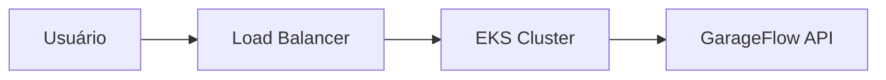

# fiap-garageflow-k8s-infra

## Objetivo
Provisionar a infraestrutura Kubernetes para executar a aplicação principal com alta disponibilidade e escalabilidade.

## Tecnologias
- Terraform
- AWS EKS
- VPC
- Security Groups
- Auto Scaling
- Load Balancer

## Estrutura
- terraform/
- manifests/
- .github/workflows/

## Deploy
- terraform init
- terraform plan
- terraform apply

## Arquitetura

