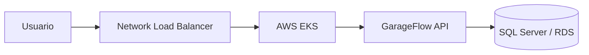

# fiap-garageflow-k8s-infra

Terraform e manifests Kubernetes para executar a API GarageFlow no AWS EKS.

## Pre-requisitos

- AWS CLI configurada e validada com `aws sts get-caller-identity`
- Terraform 1.8 ou superior
- Permissoes AWS para VPC, EC2, EKS, IAM, ELB e S3
- `kubectl` instalado para aplicar manifests manualmente

## Dependencia critica: VPC do RDS

O Terraform deste repositorio declara uma VPC `10.0.0.0/16`, duas subnets publicas e duas privadas. As subnets privadas sao `10.0.3.0/24` e `10.0.4.0/24`; as publicas sao `10.0.1.0/24` e `10.0.2.0/24`.

O EKS precisa acessar o RDS pela porta `1433`. Antes do `apply`, confirme que o RDS esta nessa mesma VPC. Se o RDS foi criado por outro state ou VPC, adapte a rede ou use uma conexao entre VPCs antes de continuar.

## Provisionamento

```powershell
cd terraform
terraform init
terraform validate
terraform plan
terraform apply
```

Outputs uteis:

```powershell
terraform output eks_cluster_name
terraform output -raw eks_cluster_endpoint
```

Depois do `apply`, configure o acesso ao cluster:

```powershell
aws eks update-kubeconfig --region us-east-2 --name garage_flow_eks
kubectl get nodes
```

## Manifests

Os arquivos em `k8s/` criam:

- namespace `garage-flow-namespace`;
- ConfigMap com configuracoes nao sensiveis;
- Deployment da API na porta 8080;
- Service `LoadBalancer` na porta 80;
- HPA entre 1 e 2 replicas.

O Secret da API deve ser criado pelo workflow da API, usando `DEFAULT_CONNECTION` e `JWT_SECRET`. Nao coloque esses valores no ConfigMap ou nos manifests versionados.

Aplicacao manual:

```powershell
kubectl apply -f k8s/namespace.yaml
kubectl apply -f k8s/configmap.yml
kubectl apply -f k8s/deployment.yml
kubectl apply -f k8s/service.yml
kubectl apply -f k8s/hpa.yml
```

## CI/CD

O workflow `.github/workflows/cd.yml` usa os Secrets `AWS_ACCESS_KEY_ID` e `AWS_SECRET_ACCESS_KEY`, e a Variable `AWS_REGION`. A imagem e a configuracao da API sao atualizadas pelo workflow do repositorio `fiap-garageflow-api`.

## Arquitetura


